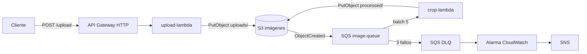

# ias-aws-lambda

Procesador de imágenes serverless en AWS. Recibe imágenes por `POST /upload`, las guarda en S3 y genera un recorte circular PNG de 40x40 px mediante una Lambda disparada por SQS. La infraestructura se define con Terraform y se despliega con GitHub Actions en tres entornos: dev, qa y prod.

## Arquitectura

Las Lambdas corren en subredes privadas de dos zonas de disponibilidad y acceden a S3 y SQS mediante VPC endpoints, sin salir a internet.

| Componente | Configuración |
|---|---|
| Red | VPC 10.0.0.0/16, subredes públicas 10.0.1.0/24 y 10.0.2.0/24, privadas 10.0.11.0/24 y 10.0.12.0/24, un NAT Gateway por zona |
| VPC endpoints | S3 Gateway limitado al bucket de imágenes, SQS Interface con DNS privado |
| API Gateway | HTTP API v2, ruta POST /upload, payload 2.0, CORS, throttling 10,000 rps, access logs JSON |
| upload-lambda | Node.js 20, 256 MB, 30 s. Acepta multipart o JSON base64, jpg/png/gif/webp, máximo 10 MB |
| crop-lambda | Node.js 20, 512 MB, 60 s, sharp 0.33. Recorte 40x40 con máscara circular y fondo transparente |
| S3 | AES-256, versionado, acceso privado. uploads/ expira a los 30 días y processed/ a los 90 |
| SQS | Cola Standard con visibility timeout de 360 s, retención de 1 día y long polling de 20 s. DLQ con retención de 14 días tras 3 fallos |
| IAM | Un rol por Lambda con mínimo privilegio |
| Observabilidad | Log groups con 14 días de retención y alarma sobre mensajes visibles en la DLQ |
